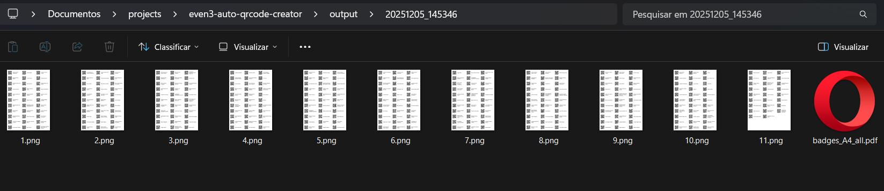

# even3 auto Qrcode Generator

<p align="center">

</p>

Gerador automatizado de QR codes a partir de planilhas Excel, organizando os códigos em páginas A4 prontas para impressão.

## Funcionalidades

- **Leitura de planilhas Excel**: Suporta arquivos `.xlsx` e `.xlsm`
- **Geração automática de QR codes**: Cria códigos QR para cada registro da planilha
- **Layout otimizado para impressão**: Organiza os QR codes em páginas A4 com grid eficiente
- **Identificação visual**: Cada QR code inclui o nome do participante ao lado
- **Saída em múltiplos formatos**: 
  - Páginas individuais em PNG (150 DPI)
  - PDF consolidado com todas as páginas
- **Organização por timestamp**: Cria pastas com data/hora para cada execução
- **Abertura automática**: Opção para abrir a pasta de saída automaticamente

## Instalação

### Pré-requisitos

- Python 3.7 ou superior

### Dependências

```
qrcode
pillow
pandas
openpyxl
```

Instale as bibliotecas necessárias usando pip:

```bash
pip install qrcode pillow pandas openpyxl
```
Ou execute:

```bash
pip install -r requirements.txt
```

## Como usar

### Preparar a planilha

Exporte a planilha de usuarios no Even3

Sua planilha Excel deve conter obrigatoriamente as seguintes colunas:

- **Nome**: Nome completo do participante
- **Número de Inscrição**: Código único que será convertido em QR code

Exemplo:

| Nome | Número de Inscrição |
|------|---------------------|
| João Silva | 12345 |
| Maria Santos | 12346 |

### Executar o script

#### Uso básico:

```bash
python qrcode_creator.py -file planilha.xlsx -output ./saida
```

#### Comandos disponíveis:

```bash
# Especificar arquivo e pasta de saída
python qrcode_creator.py -file planilha.xlsx -output ./saida

# Usar caminho completo no Windows
python qrcode_creator.py -file "C:\Users\nome\planilha.xlsm" -output "C:\Output"

# Abrir pasta automaticamente após gerar
python qrcode_creator.py -file planilha.xlsx -output ./saida --open

# Ver ajuda
python qrcode_creator.py --help
```

#### Parâmetros:

- `-file` ou `-f`: **(obrigatório)** Caminho para o arquivo Excel
- `-output` ou `-o`: **(opcional)** Diretório de saída (padrão: `./output`)
- `--open`: **(opcional)** Abre a pasta de saída automaticamente

### Resultado

O script gera:

1. **Pasta com timestamp**: Ex: `output/20241205_143022/`
2. **Páginas A4 numeradas**: `1.png`, `2.png`, `3.png`, etc.
3. **PDF consolidado**: `badges_A4_all.pdf` contendo todas as páginas

Cada página contém múltiplos QR codes organizados em grid, com:
- QR code à esquerda (120x120 pixels)
- Nome do participante à direita
- Dimensões: 400x150 pixels por item

## Configurações Técnicas

- **Resolução**: 150 DPI
- **Tamanho da página**: A4 (8.27" x 11.69")
- **Dimensões em pixels**: 1240 x 1754
- **Itens por página**: Calculado automaticamente (aproximadamente 18-24 itens)
- **Margens**: 8 pixels (reduzidas ao mínimo seguro)
- **Espaçamento entre itens**: 8 pixels

## Solução de Problemas

### Erro: "Coluna 'Nome' não encontrada"
Verifique se sua planilha possui exatamente as colunas `Nome` e `Número de Inscrição`.

### Erro: "Arquivo não encontrado"
Certifique-se de que o caminho para a planilha está correto e use aspas se o caminho contiver espaços.

### Fonte padrão sendo usada
O script tenta carregar fontes do sistema (Arial, DejaVu Sans, Helvetica). Se não encontrar, usa a fonte padrão do sistema.
